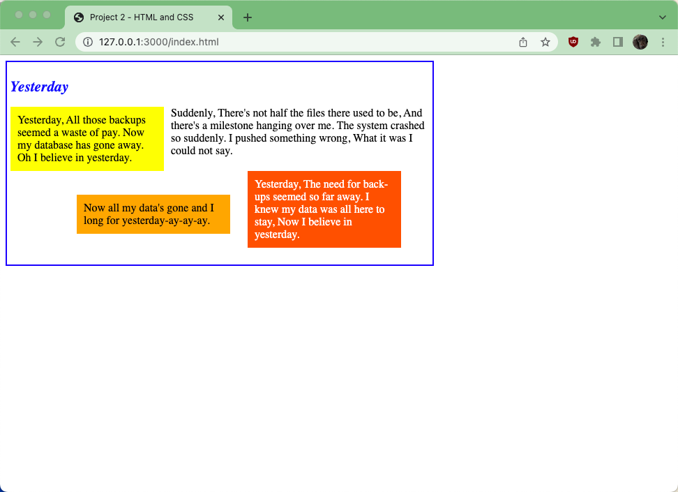

# Project 2

## Project links

* [Video Walkthrough](https://youtu.be/lHeWbSgfw5I)
* [Grading Rubric](https://shanepanter.com/teaching/universal-grading-rubric.html)

## Overview

The goal of this project is to take the following text below and write both the
HTML and the CSS to style it so it looks like what is shown in the screenshot
below.

    Yesterday, All those backups seemed a waste of pay. Now my database
    has gone away. Oh I believe in yesterday.

    Suddenly, There's not half the files there used to be, And there's a
    milestone hanging over me. The system crashed so suddenly. I pushed
    something wrong, What it was I could not say.

    Now all my data's gone and I long for yesterday-ay-ay-ay.

    Yesterday, The need for back-ups seemed so far away. I knew my data
    was all here to stay, Now I believe in yesterday.

## Task 1 - Author the Website

Use CSS to format the web page so it looks exactly like the screenshot shown
above. You can not use inline CSS, you must put all your CSS in the file
**style.css**. Using inline CSS will result in a substantial grade penalty.

- Use a `
` for each of the 4 verse containers and the outer container.
- The title “Yesterday” uses an `<h2>` tag with a 16pt font that is blue and italicized. Do not use an `<i>` tag.
- The entire song is embedded in a container that is 600 x 280 pixels, has a two
  pixel solid blue border, and a five pixel padding. The background color is
  #F0F0F0.
- The outer `
`'s first child is the `<h2>`. The 4 child `
`s follow, declared in the order listed below.
- The yellow section:
  - has a background color of "yellow"
  - floats to the left
  - has a 200 pixel width
  - has a 10 pixel padding
  - has a right margin of 10 pixels, with all other margins set to 0
- The section with no background color has no CSS styling.
- The orange section:
  - has a background color of "orange"
  - is positioned at (110px, 200px) with absolute positioning
  - has a 200 pixel width
  - has a 10 pixel padding
- The orange-red section:
  - has a background color of "rgb(255, 80, 0)"
  - has white text
  - floats to the right
  - has a 200 pixel width
  - has a 10 pixel padding
  - has a right margin of 40 pixels, a top margin of 20 pixels, and all other margins set to 0
- Do not use ` ` anywhere in your HTML.

## Task 2 - Testing

Run all the provided tests that are written in the file **test/test.js**. Due
to the complexity of CSS there are an infinite number of permutations to get your
website to look like the example above. Thus, our tests will just be looking
at the html.

## Task 3 - Screenshot

Once you have your webpage rendering correctly you will need to create a screen
shot of how it looks. You will need to name your screenshot **student-page.png**
and place it in the root directory. Once you have added the screenshot you can
display it in the **Retrospective.md**.

- [How to Screenshot on Mac](https://support.apple.com/guide/mac-help/take-a-screenshot-mh26782/mac)
- [How to Screenshot on Windows](https://support.microsoft.com/en-us/windows/use-snipping-tool-to-capture-screenshots-00246869-1843-655f-f220-97299b865f6b)

## Task 4 - Complete the Retrospective

Once you have completed all the tasks open the file Retrospective.md and complete
each section that has a TODO label. Reference the grading rubric for details on how
this will be graded.

## Task 5 - Add, Commit, Push your code

Once you are finished you need to make sure that you have pushed all your code
to GitHub for grading! The Video walk through linked in the beginning of this
document will show you how to accomplish this task.

## Acceptance Criteria

- You used the specified HTML tags
- Your CSS is in an external file
- You pass all instructor provided tests
- You have provided a screenshot in your Retrospective.md
